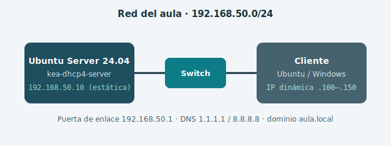

## Qué vas a hacer

En esta práctica desplegarás un **servidor DHCP con Kea** en Ubuntu Server 24.04
para dar servicio a la red del aula. Kea es el servidor DHCP moderno de ISC,
sucesor del clásico `isc-dhcp-server`, y es el que encontrarás cada vez más en
entornos profesionales.

## Datos de la red

| Parámetro | Valor |
|---|---|
| Red del aula | `192.168.50.0/24` |
| Servidor DHCP (estática) | `192.168.50.10` |
| Rango dinámico | `192.168.50.100` – `192.168.50.150` |
| Puerta de enlace | `192.168.50.1` |
| DNS | `1.1.1.1` y `8.8.8.8` |
| Dominio | `aula.local` |

:::note{id="nota-entorno"}
La práctica está pensada para dos máquinas virtuales en la misma red interna:
un **Ubuntu Server 24.04** (servidor) y un cliente cualquiera (Ubuntu Desktop,
Windows…). Si trabajas en CML o en otro simulador, la lógica es idéntica.
:::

:::question{id="previo-que-es-dhcp" type="long-text" required="true"}
Antes de tocar nada: explica con tus palabras **qué problema resuelve DHCP**
en una red local y qué pasaría en el aula si no existiera.
:::

:::question{id="previo-puerto" type="single-choice" required="true"}
¿En qué puerto **escucha un servidor DHCP** las solicitudes de los clientes?

- [ ] TCP 67
- [x] UDP 67
- [ ] UDP 68
- [ ] TCP 53
:::

:::checkpoint{id="check-maquinas-listas" required="true"}
Tengo las dos máquinas virtuales creadas y conectadas a la misma red interna.
:::
